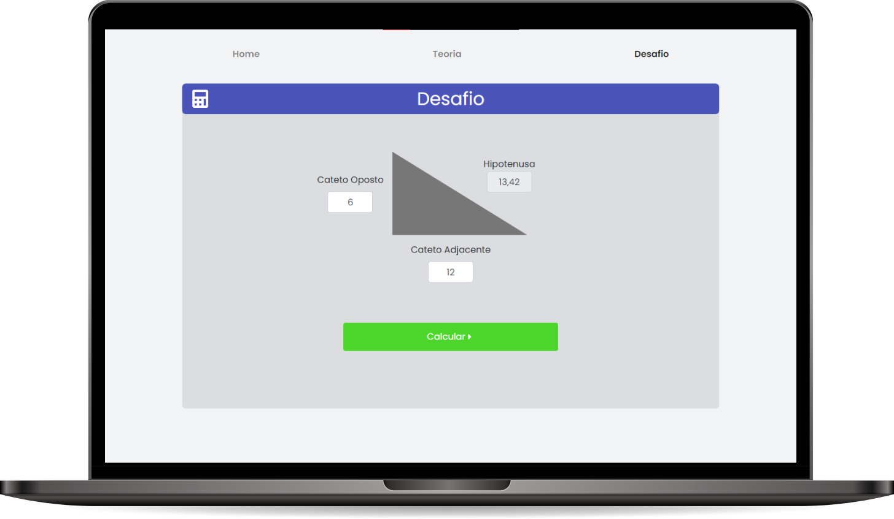

<h1 align="center">
  
</h1>

<p align="center">
  <a href="#-tecnologias">Tecnologias</a>&nbsp;&nbsp;&nbsp;|&nbsp;&nbsp;&nbsp;
  <a href="#-projeto">Projeto</a>&nbsp;&nbsp;&nbsp;|&nbsp;&nbsp;&nbsp;
  <a href="#-requisitos-da-aplicação">Requisitos da aplicaçao</a>&nbsp;&nbsp;&nbsp;|&nbsp;&nbsp;&nbsp;
  <a href="#-setup">Setup</a>&nbsp;&nbsp;&nbsp;|&nbsp;&nbsp;&nbsp;
  <a href="#memo-licença">Licença</a>
</p>

<p align="center">
  <a href="https://github.com/cleysonsilvame/desafio-cromai-electron/commits/main">
    
  </a>

  <a href="https://github.com/cleysonsilvame/desafio-cromai-electron/issues">
    
  </a>

  
</p>

<p float="center">
  
</p>

## 🚀 Tecnologias

Esse projeto foi desenvolvido com as seguintes tecnologias:

- Electron
- React.js
- Next.js
- Typescript
- JavaScript

## 💻 Projeto

### Desafio proposto pela empresa Cromai

A missão era desenvolver um fork do front-end em [React](https://github.com/cleysonsilvame/desafio-cromai) para Electron que fosse capaz de resolver o cálculo do Teorema de Pitágoras.
Conectado a uma [API em Python](https://github.com/cleysonsilvame/desafio-cromai-api) com Flask para servir o cálculo.

## ⚙️ Requisitos da aplicação

- Node
- Yarn ou NPM
- Rodar o servidor em python disponível [aqui](https://github.com/cleysonsilvame/desafio-cromai-api), ou usar o deploy feito no heroku com este caminho: https://desafio-cromai-api.herokuapp.com
- Entedimento desta portabilidade

| Part       | Source code (Typescript) | Builds (JavaScript) |
| ---------- | ------------------------ | ------------------- |
| Next.js    | `/renderer`              | `/renderer`         |
| Electron   | `/electron-src`          | `/main`             |
| Production |                          | `/dist`             |

## 🔧 Setup

```bash
#.env.example para .env.local e definir a URL da api
NEXT_PUBLIC_API_URL=http://localhost:5000

#terminal
npm install
#ou
yarn

#terminal
npm run dev
#ou
yarn dev
```

## :memo: Licença

Esse projeto está sob a licença MIT. Veja o arquivo [LICENSE](LICENSE) para mais detalhes.

### 🙋‍♂️ Autor

---

<a href="https://github.com/cleysonsilvame/" title="Cleyson Silva">
 
 <br />

<sub><b>Cleyson Silva</b></sub> 🚀</a>

👋🏽 Entre em contato!

[](https://www.linkedin.com/in/cleyson-silva-639b01188/) [](mailto:cleysonsilva.me@gmail.com)
